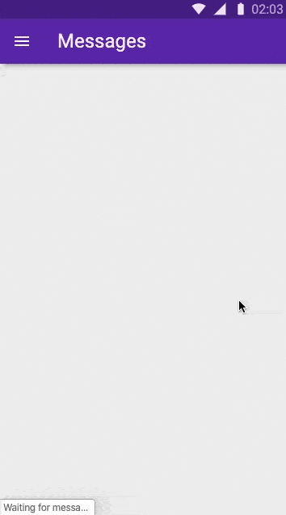
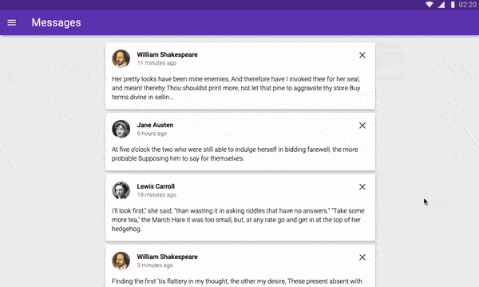

# **Infinite Scrolling Messages App**

> ### An interface that shows a potentially very long list of messages using the Material Design Guide.

Visit — https://infinite-scrolling-message-app.firebaseapp.com/

## Project Setup

This project is written in vanilla HTML, CSS and Javascript. Setup uses [Parcel](https://parceljs.org/) , [Babel](https://babeljs.io/) , [PostCSS](https://postcss.org/) and [Firebase](https://firebase.google.com/) for hosting.

To run this project locally —

- Prerequisites - You need to have [Node.js](https://nodejs.org/en/download/) and [npm](https://docs.npmjs.com/) installed on your machine
- Clone/Download this project
- Navigate to the folder and Run the command `npm i`
- To run the Dev Server, run `npm run serve` this will spin up a local dev server on [localhost:1234](localhost:1234) with HMR enabled
- For optimised production build , run `npm run build`
- You can serve this project from `/dist` directory

# Mobile View

# Desktop View

## Technologoes Used

- Intersection Observer API for Infinite Scrolling ([MDN Docs](https://developer.mozilla.org/en-US/docs/Web/API/Intersection_Observer_API))

- Messages API to mock content - https://message-list.appspot.com/messages ([See API Docs](https://message-list.appspot.com/))

Made with ️❤︎ by **[Abhijeet Saxena](https://itsrockyy.github.io/ "Abhijeet Saxena")**
